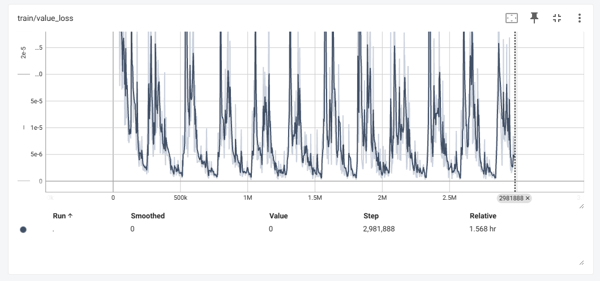

# Crypto Reinforcement Learning Trading Bot (PPO)

## Overview

This repository contains a work-in-progress project focused on building a Reinforcement Learning (RL) agent for trading stocks using historical market data. The project leverages the OpenAI Gym environment, custom-built environments for trading, and the Stable Baselines3 library for RL. The goal is to train a model to predict and make trading decisions based on historical stock prices and other financial indicators.

## Project Structure

- **Data Preparation**: Load and preprocess historical stock data.
- **Custom Environment**: Define a custom trading environment using Gym.
- **Model Training**: Train a reinforcement learning model using Stable Baselines3.

## Files and Directories

- `main.ipynb`: Main script to prepare data, define the environment, and train the model.
- `model/Log`: Directory for TensorBoard logs.

## Dependencies
Current dependencies being used are 

- `gymnasium`: For creating and managing the trading environment.
- `gym_anytrading`: Custom environments for trading tasks.
- `pandas`: For data manipulation and analysis.
- `numpy`: For numerical operations.
- `stable_baselines3`: For reinforcement learning models.
- `matplotlib`: For plotting and visualization.
- `scikit-learn`: For data scaling and preprocessing.

## Screenshots

Here are some screenshots of the project's progress:

### Screenshot 1

([images/screenshot 1.png](https://github.com/C0d3x23/Reinforcement-Learning-For-Trading-Bot/blob/4dd373f8d9ca51fff3f8dab50f9a42181e3039b5/images/screenshot%201.png))

### Screenshot 2

Note: As of this writing the model is is still in training. 
